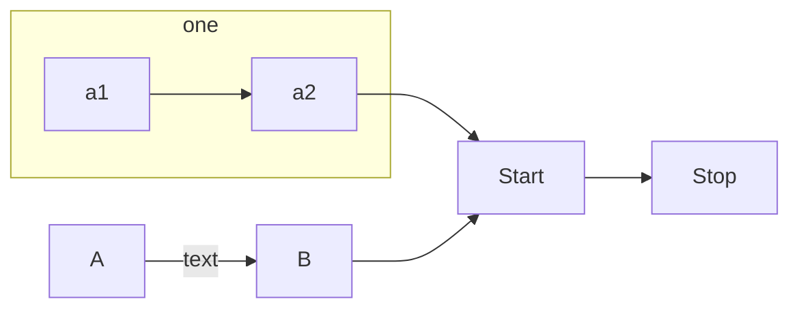
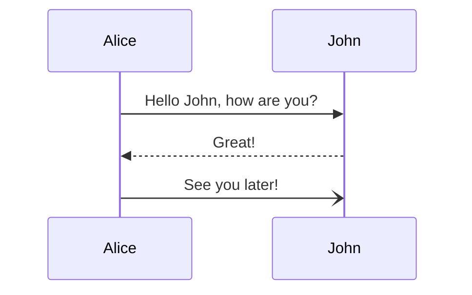
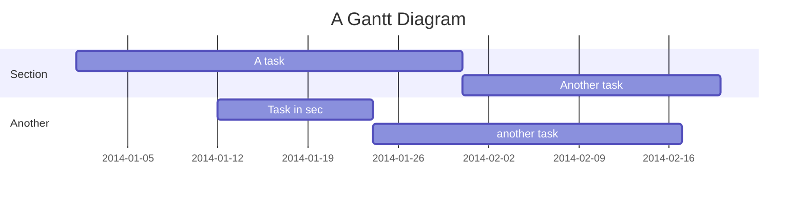
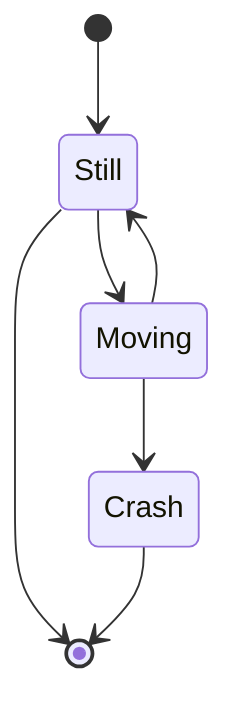
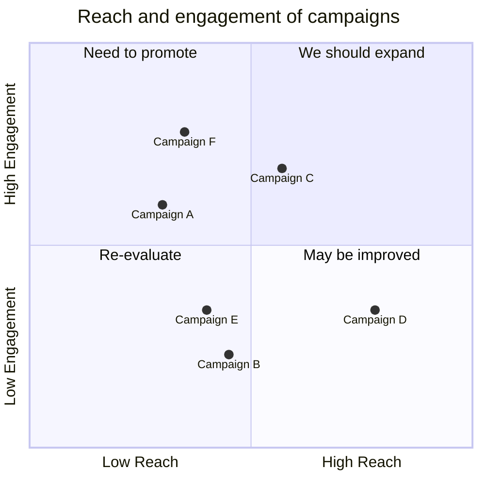
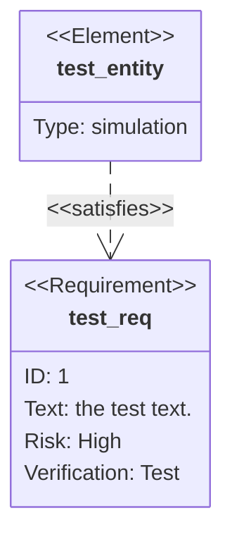

# artefakty
- Výjezdní táborová rada
	- 
	- cíle tábora 22
	- cíle tábora 23

- Všechny tabulky
	-  ů

- Etapa/
	- hotové etapy 23/
	- questy+bodování 23

- Programy/
	- old/

- Jídlo/
	- jídelníčky

- tabulky/
	- koupele 
	- bodování
	- ranní sběr

- forms/
	- z5v
	- návštěvy
	- rozpočet

- Vize tábora 23

- z5v.txt

# cíle

# mermaid experiment

