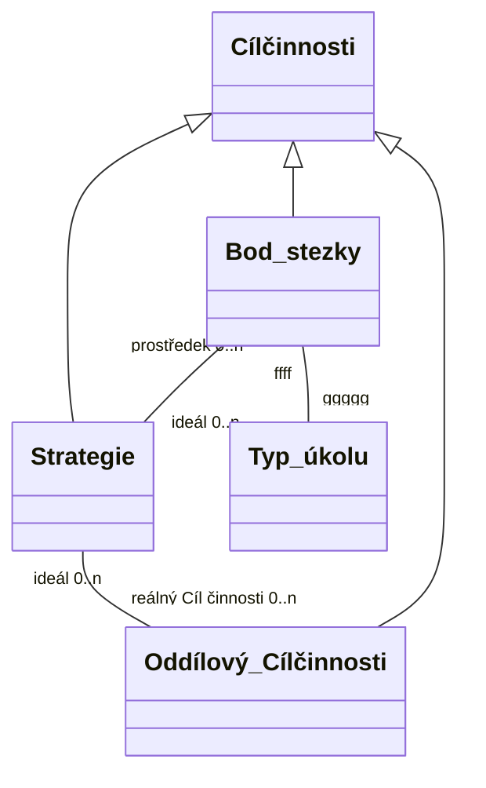

[[BP/README|README]]

# Dv8
## zaměření
### Aim %% fold %% 
![[Zaměření.bp#Cíl]]
### Objectives + methods %% fold %% 
![[Zaměření.bp#Dílčí cíle metody]]
## dosažení
### Výstupy
- model pojmů
- schema databáze
- schema dokumentů
- model postupu zrcadlení dat do databáze

### Přínosy
enables/supports...
1. reusability of created content
2. quality mgmt
3. task mgmt 

### Limitace
1. Čas
2. Nehledám, ani se nesnažím vytvořit jedinou aplikaci, která by měla všechny požadované funkce. 
3. Vybírám google workspace jako základní prvek pro návrh, protože již v oddíle využíváme službu gDrive jako primární uložiště pro naše data v digitální podobě, mimo fotek. Všichni jsou na ně zvyklí, navíc ani nepředstavuje omezení, spíše naopak. *Nicméně v rámci hledání řešení, poslouží dostatečně dobře jako rámec a umožní mi tak se podrobněji věnovat modelování.*

### Struktura
viz. drawio [[../assets/models/concept-model-ke-konzultaci3.drawio.png|strana: model textu práce]]

### Časový plán
výběr tématu proběhlo v únoru, na začátku dubna jsem dodělával minimální verzi program

## Metodika
### 1. Pojmy - skutečnost
> **Výběr** údajů k zaznamenávání.
#### Z pohledu Junáka:
Definovat pojmy `{ "program", "aktivita", "činnost", "událost" }` a jim nejbližší související koncepty, na základě literatury oficiálně vydané českým Junákem. = map(`Knihovna/Metodika`, f) 
- f = (p, s){
- Vyhledej v souboru f pojem p.
- Pro každy výsky p pak:
	- Pokud je součástí definice, získej definici.
	- Prohlédni okolní odstavce, případně kapitolu pokud bude soubor s tématicky blízko pojmu p. A v případě že narazím na jiný pojem než p, který identifikuji jako potenciálně užitečný pro tvořenou bázi, získám ho a uvedu odůvodnění.
	Výstup:: `[[ definice ], [ pojemKandidát, vztahKp, [ důvod]]]` 
- Každý pojemKandidát pak: pokud ho odůvodníš jako užitečný, přidej ho do listu pojmu k definování.
**Získat** `[definice]` pro všechny analyzované pojmy. 
Deduplikovat; vybrat nejpodstatnější;
transformovat do srozumitelného popisu, vhodného pro text bp.
#### Z pohledu vedoucího:
Prozkoumat existující báze a zjistit, které údaje o programech jejich tvůrci považovány za dostatečně důležité na to, aby je zapisovaly? `{ existující záznamy na disku ; velká encyklopedie her - kniha ; chystamprogram.cz }`
**Získat** vlastnosti, které jsou existujícími bázemi použity pro organizaci záznamů. 
Vlastnostmi jsou myšleny pojmy, které se opakují u záznamů v celé, nebo části analyzované báze.
Pro naše `existující soubory` 
- projít celý sdílený disk a vybrat pouze soubory, jejichž obsah by měl být převáděn do báze.
- vytvořit mapu externí i interní struktury vybraných souborů
	- externí= - v jakých složkách počínaje v kořenové, je soubor uložen? - Jaké soubory jsou na stejné úrovni jako daný soubor?
	- interní= - Které pojmy jsou použity pro organizaci? Kterým typem gDoc elementu stránky jsou jednotlivé pojmy zapsané? (Ptám se proto, abych měl představu o tom, co je pro cílové uživatele komfortní na používání. Nebo alespoň bylo v době zapisování.)
	**+získám** mapu báze, kterou mají k dispozici moji cíloví uživatelé v současné době.
Pro `encyklopedie` a `chystamprogram`

#### Z pohledu řízení:


### 2. Datové struktury
> **Výběr** datových struktur pro použití v návrhu.

Výstup:: ds s rozhraním pro *čtení* i *psaní* splňující stanovené **požadavky**


### 3. Nejlepší praktiky
> **Výběr** postupů pro vytvoření návrhu.

Výstup:: *sady pravidel* pro využité postupy


### 4. Model pojmů
> **Vytvořit** model pojmů a jejich vztahů. 

Výstup:: koncept model


### 5. Databázové schema
> **Vytvořit** schema pro databázi. 

Výstup:: db schema


### 6. Dokumentové schema
> **Vytvořit** schema pro dokumenty. 

Výstup:: doc schema


### 7. Postup údržby
> **Navrhnout** postup pro udržování dat v databázi konzistentní se skutečnými instancemi tříd. 

Výstup:: flowchart, možná kód


### 8. Vyhodnocení výsledků
> Ověřit _proveditelnost_ a _úspěšnost_ návrhu.) 

Výstup:: Výsledky úspěšnosti. Důkaz proveditelnosti


# procesní model %% fold %%
## v1
1. plánování událostí (které a kdy budou)\[1-2 / rok]
2. příprava konkrétních událostí
	1. schůzka
	2. výprava
	3. tábor
3. pořádání události
4. archivace, rafinování získaných informací (aktuálně neexistuje D)

klíčový proces:
  1+3

podpůrné proc:
  2+4


# případy využití %% fold %%
Případy užití:  

## zaznamenávání aktivit, které by pomohly ve sledování některých cílů
(aktivit, které by jsme někdy mohli realizovat)

Zaznamenávat nápady

## hledání inspirace pří přípravě 
(tvorba nového i využití již zaznamenaného)  
### otázky: 
- 
## hledání při improvizaci 
(když NÁHODOU bude potřeba)  
### otázky: 
- Které aktivity/programy sledují konkrétní cíle (e.g. aktuální události)?
- Které aktivity/programy zapadají do požadovaného symbolického rámce?
- Které aktivity/programy jsou proveditelné s aktuálně dostupným vybavením?(vyškrtat co nemám)
## obohacení výstupů o zjištění ze Z5V 
(podpora NEopakovaní chyb a kontinuálního zvyšování kvality)  
### otázky: 
- Jaké programy byly a jaké parametry měly?
- Které části nefungovaly?
- Které části byly úspěšné?
## automatické tvorba úkolů na základě událostí a ostatních nekompletních záznamů
### otázky: 
- Které záznamy by bylo vhodné doplnit?
- Jak vylepšit přípravu a poučit se z chyb, ale i úspěchů?

## automatická tvorba přehledů o napojení vykonaných programu na cíle
(usnandní vyhodnocování kvality vykonaných programů + implicitně usnadní plánování dalšího směru a obsahu aktivit)
### otázky: 
-


# kompetenční otázky %% fold %% 

Hry které se osvědčily a delší dobu nebyly na programu
Hry které se ještě nehrály
Osvědčený naučný program napojený na bod stezky, který většina ze členů družiny nemají splněný


# definice pojmů %% fold %% 

Schůzka může mít výstup různý záznam.
-
Aktivita během události (část programu) může produkovat různý záznam.

 (a) \[část programu]  (p) \[může vyžadovat] (různý záznam)

Cíl má metriku
dílAktivity -- aktivita


Ggghhsjd %% fold %%
 Fffh


Tvorba ontologie která by na základě reasoningu aktualizovala/doplňovala 

Využití ontologie jako auto-tagovacího systému?
owlgred. Je to stále validní konceptuání model?

Definice "zábavná" vs. "Naučná"?
Které diagramy bych si pro implementaci alespoň dema měl připravit?
Kompetenční otázky klíčové pro moje modelování?


hodnocení + z5v psát vždy pod výstup práce ke kterému náleží (Aktivita, Program, Událost)
# zdroje

# implementace %% fold %% 

```bash
#!/bin/bash
docker run    --restart always     --publish=7474:7474 --publish=7687:7687     --env NEO4J_AUTH=neo4j/proutek345  --volume=/usr/data:/data --volume=/usr/gdb7-log:/log --detach --name="gdb7"    neo4j:5.18.0

```

# konceptuální model %% fold %% 

## v3.1 - plantUML
[[assets/models/plantUML/classDiagram.plantUML.bp]]
## v3.0 - test %% fold %%




```plantuml
foo "x" - "d" bar
Cíl_činnosti <|-- Strategie
Cíl_činnosti <|-- úkol_stezky
Cíl_činnosti <|-- výchovný_cíl
Typ_úkolu "r" -- "k" úkol_stezky
Strategie "ideál | 0..*" -- "prostředek | 0..*" výchovný_cíl 
úkol_stezky "prostředek 0..*" -- "cíl 0..*" výchovný_cíl

Událost "1..*"-- "n" Programový_blok
skautská_činnost <|-- Událost
```


## v2.2 %% fold %%
![[assets/images/diagrams/conceptuals/concept-schema-ke-konzultaci2.2.png]]
### Komentář: 
proč šestiúhelníky?
vlastnost "obsazena"? (to mělo být "obsažena")
bylo by lepší mít pojmenová konce vztahů více odpovídající realitě
> Dopředělat do standartního UML diagramu tříd

:
-  roměnné parametry každé aktivity?
## v2.1  %% fold %% 
![[assets/images/diagrams/conceptuals/concept-schema-ke-konzultaci2.1.png]]fcgguu
## v2
### schema: %% fold %% 

> [!NOTE]
> - [x] Událost má symbolicky rámec a z toho vyplývá scénka

Událost může mít přihlášené lidi 

Aktivita může mít různé verze (starší/novější), a je důležité zachytit, ke které verzi byla poskytnuta z5v.

Aktivity mohou mít několik lehce odlišných verzí. 
Verze by se měly drobně lišit, ne však příliš. pak nová aktivita. 
Každá verze má nějaké vlastní parametry (doba nabíjení, počet stanovišť, počet týmů, běhaná vzdálenost, symbolický rámec, ...)
[[Podklady/Nápady/todonápady]]

U hry přidat parametr Cíl činnosti/Cíl činnostie hráčů?
Nebo vedle mechanik jako entitu obsaženou v pravidlech?
Aktivity by měly být reusable (očištěné od prvků specifických pro konkrétní události).

Události jsou primární produkt. Jaké jsou procesy jejich přípravy a provedení?

Mechanika je npř Cíl činnosti hráče, hraní po týmech, či po jednotlivcích.
Mechanika = hráč musí/může/nemůže
#= hráč chce

---
Členové mohou mít splněné některé body ke splnění

Programový blok vychází z konkrétní události, mohl by tedy mít parametr "věk účastníků"

Indpiruj se u návrhu db pro DnD

---
Aktivita překreslování obrázku podle slovního popisu je hra, nebo naučná? A co překreslováné obrázky, co pro aktivitu představují?
Chci vážně dělit aktivity na zábavné, naučné a potřebné? > ANO

---
Program =vybrané aktivity s konkrétními parametry. By měly mít ještě připravené otázky jejichž zodpovězení proběhne ve z5v.

![[assets/images/diagrams/conceptuals/concept-schema-ke-konzultaci2.png]]
## v1 %% fold %% 
### schema:
![[concept-schema-ke-konzultaci1.png]]
### Komentáře-schema:

#### všeobecné
![[Conceptschemakomentar1#^KD92LVAFaME3Q98H8p1]]


#### pojmenování vztahů (5)
![[Conceptschemakomentar1#^SQW8CNSYaME3Q98H8p1]]
![[Conceptschemakomentar1#^29AIIULZaME3Q98H8p1]]
![[Conceptschemakomentar1#^DQEBPJ73aME3Q98H8p1]]
![[Conceptschemakomentar1#^9226QHQ5aME3Q98H8p1]]
![[Conceptschemakomentar1#^NNAEKGATaME3Q98H8p1]]

#### vztahy (2)
![[Conceptschemakomentar1#^AHZI6TLZaME3Q98H8p1]]
![[Conceptschemakomentar1#^22E9IMW7aME3Q98H8p1]]

#### pojmenování entit (2)
![[Conceptschemakomentar1#^5EPBB4R8aME3Q98H8p1]]
![[Conceptschemakomentar1#^G8NGTBVUaME3Q98H8p1]]


#### entity (3)
![[Conceptschemakomentar1#^YRKPC5Y6aME3Q98H8p1]]
![[Conceptschemakomentar1#^ZFXBAICMaME3Q98H8p1]]
![[Conceptschemakomentar1#^EC9RGPU6aME3Q98H8p1]]

#### parametry 
doba stavby >> čas na přípravu
![[Conceptschemakomentar1#^PQAHBZW4aME3Q98H8p1]]

#### gen/spec
hlavní Cíl činnosti aktivity
![[Conceptschemakomentar1#^FIPPGZWWaME3Q98H8p1]]

#### barvy
![[Conceptschemakomentar1#^PPTYFIE6aME3Q98H8p1]]


### model:
![[assets/models/datamodeller/odm-Logical230703.png]]
### Komentáře-model:


## koncepty(entitní množiny) %% fold %%
~~Družina~~
~~Člen~~
~~Aktivita~~
Programový blok
~~Výprava~~
~~Schůzka~~
~~Tábor~~
~~Hra (zábavné)~~
~~Naučný~~
~~Z5v~~
~~Záznam/zápis Plánu~~
~~Záznam/zápis průběhu~~
Komentáře k provedení
~~Vedoucí~~
~~Cíl činnosti aktivity~~
~~Bod stezky~~
~~Bod odborky/vlčka~~
~~Herní mechanika~~
~~Potřeba/materiál~~
~~Prostředí~~


# v0 %% fold %%
[[Podklady/Nápady/bp.Příprava]]
## Methods:
1. 
## Deliverables
1. 
## Contributions:
1. 
## Limitations:
1. 
## Structure:
1.
## Time-plan:
- 


